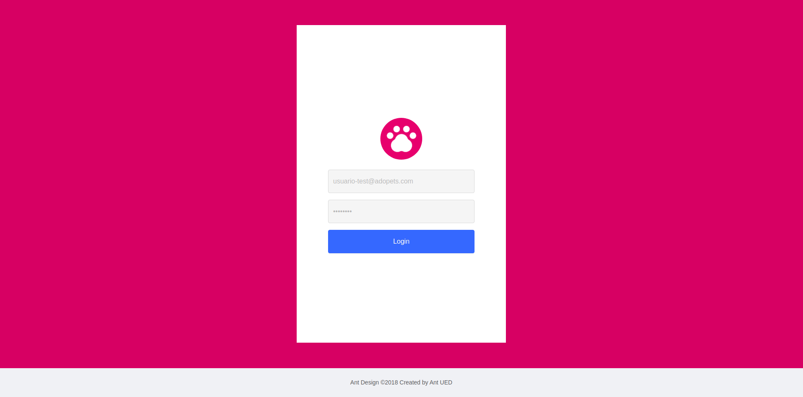

# Typescript + ReactJS + Pets!

## Getting Started

Install dependencies.

```console
yarn
```

Configure your environment keys according with .env-example

```console
cp .env-example .env
```

Execute the project

```console
yarn start
```

## Images

Login



Pet List, Filter and Order


## What this project contains

1. ReactJS
2. Typescript
3. API requests to Filter, Order and List
4. Ant Design + styled-components
5. Pagination
6. Sidebar
